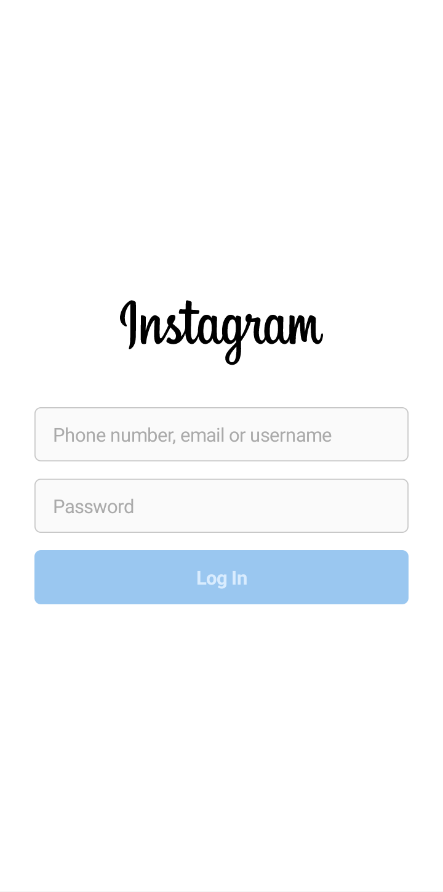
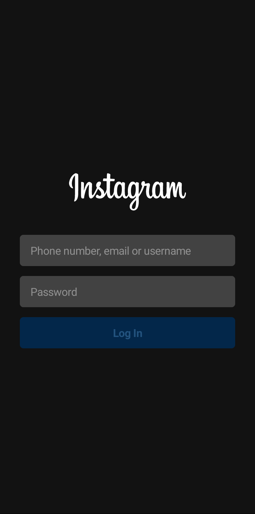

# ComposeInstagram

A clone of Instagram with the instagram4j API and my focus on this project is Jetpack Compose, and 
learn how to write a test for it. Like other projects, I always try to use the latest tools and features.

**A [Preview video](https://youtu.be/I0idZRt2k2Q "Youtube") from home screen.**

## Screenshots
Light theme | Dark theme 
--- | --- 
 | 
 |  

